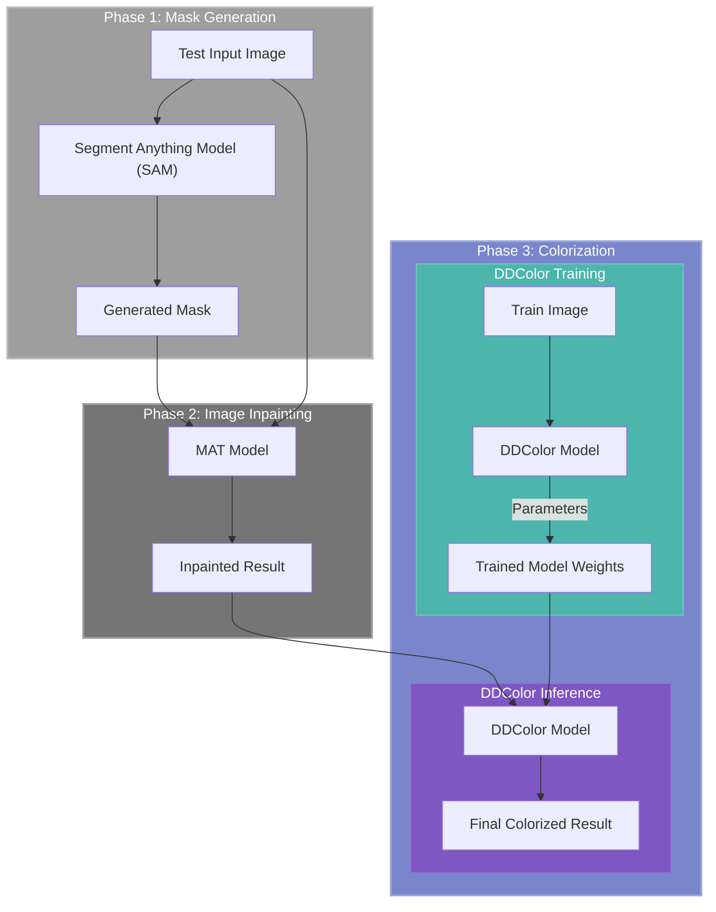

# DACON 이미지 색상화 및 손실 부분 복원 AI 경진대회 [1st Place]
1st Place Solution for DACON Image Colorization and Restoration AI Competition




## 1. SAM (Segment Anything Model)
```bash
pip3 install torch torchvision torchaudio --index-url https://download.pytorch.org/whl/cu118
pip install segment_anything opencv-python
```

### Download SAM model
```bash
wget https://dl.fbaipublicfiles.com/segment_anything/sam_vit_h_4b8939.pth
```
### Inference
```bash
cd 1_SAM
python find_mask.py
```
Generated masks will be saved in the `data/test_mask` directory.

## 2. Inpainting with [MAT (Mask-Aware Transformer)](https://github.com/fenglinglwb/MAT)

- Input: Test Input Images + Masks
- Output: Inpainted Images
- Download pretrained model '*Places_512_FullData.pkl*' from [One Drive](https://mycuhk-my.sharepoint.com/:f:/g/personal/1155137927_link_cuhk_edu_hk/EuY30ziF-G5BvwziuHNFzDkBVC6KBPRg69kCeHIu-BXORA?e=7OwJyE) and put it in the `2_MAT/pretrained` directory.

### Install dependencies
```bash
pip install -r requirements.txt
```
### Inference
```bash
cd 2_MAT
make inpaint
```
Inpainted test images will be saved in `data/test_inpainted` directory.


## 3. Colorization with [DDColor (Dual Decoder Colorization)](https://github.com/piddnad/DDColor)

Download pretrained model for fine-tuning and finetuned model, and install dependencies
```bash
cd 3_DDColor
make download

python setup.py develop
```

### Train
```bash
cd 3_DDColor
make train
# or make train_ddp
```
Trained models will be saved in `experiments/train_ddcolor_l/models` directory.

### Inference
```bash
cd 3_DDColor
make test
```
Colorized test images will be saved in `results/test_dacon/visualization/Dacon` directory.